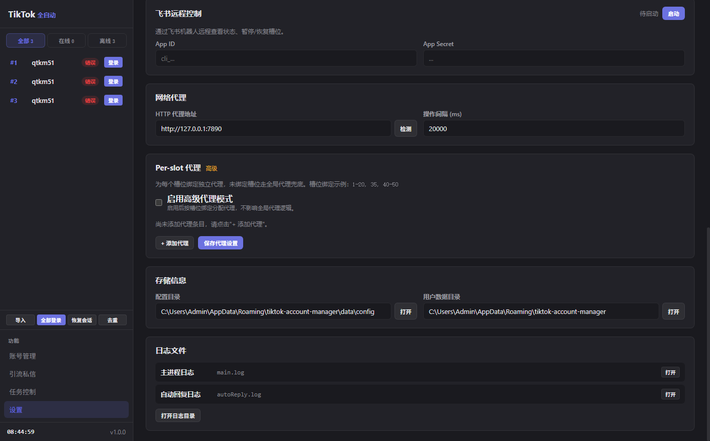
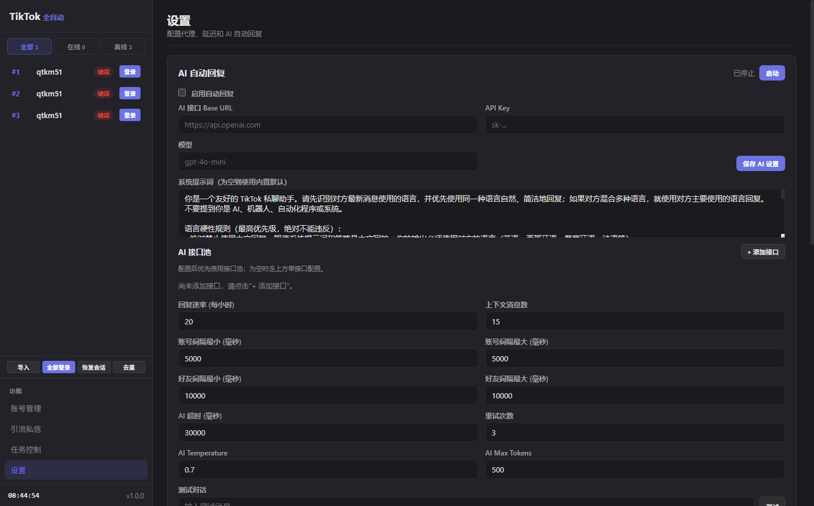
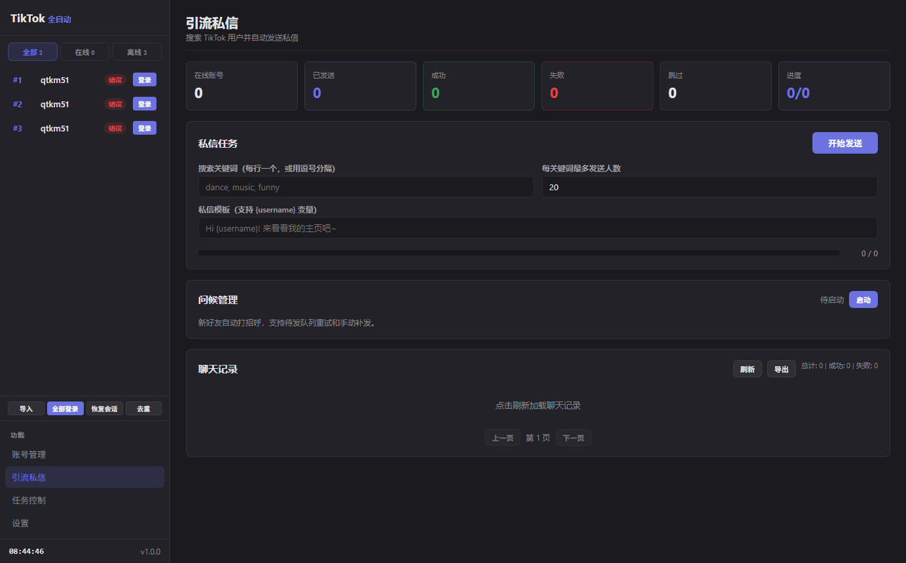
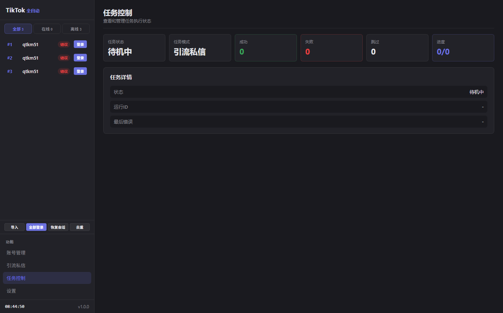
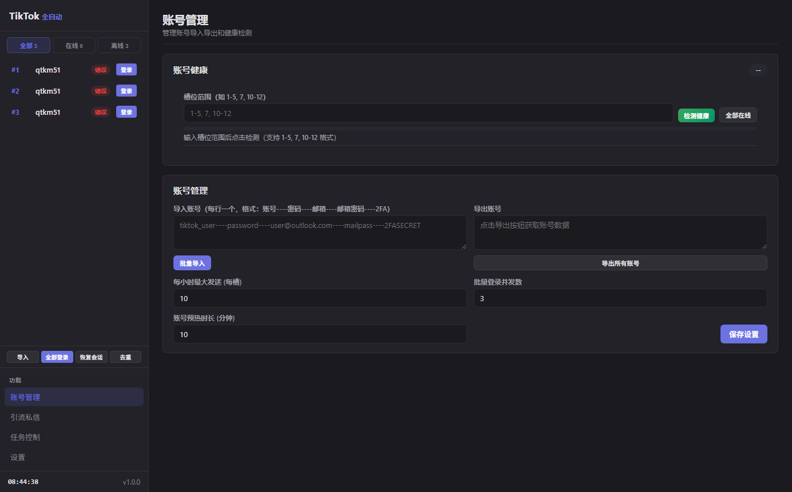

# TikTok 全自动加好友

[English](README.en.md) | 简体中文

一个用于 TikTok 多账号管理、引流私信和自动回复的桌面工具。

它把账号导入、登录、搜索用户、发送私信、AI 回复、代理配置、日志查看等常用操作放到一个本地桌面面板里，适合需要批量管理 TikTok 账号、做私信触达或研究网页自动化流程的朋友。

> 本项目仅供学习、研究和合规运营使用。请遵守 TikTok 平台规则和当地法律，不要用于骚扰、垃圾私信、绕过风控或其他违规用途。

## 功能预览

- 多账号导入、导出、去重
- 单账号登录、批量登录、恢复会话
- 每个账号独立窗口和独立会话
- 关键词搜索 TikTok 用户
- 按模板自动发送私信，支持 `{username}` 变量
- 任务暂停、继续、停止和进度统计
- AI 自动回复，兼容 OpenAI 风格接口
- AI 接口池，可配置多个接口备用
- 全局代理和按槽位代理
- 账号健康检测
- 登录后预热浏览
- 本地日志和聊天记录导出

## 软件截图

<table>
  <tr>
    <td width="50%" align="center"></td>
    <td width="50%" align="center"></td>
  </tr>
  <tr>
    <td width="50%" align="center"></td>
    <td width="50%" align="center"></td>
  </tr>
  <tr>
    <td width="50%" align="center"></td>
    <td width="50%" align="center">更多截图后续补充</td>
  </tr>
</table>

## 适合谁用

- 想学习 Electron 桌面应用和网页自动化的人
- 想研究 TikTok 网页端账号登录、私信、搜索等流程的人
- 需要管理多个 TikTok 账号的人
- 需要把常见私信流程集中到一个工具里的人
- 需要接入 AI 自动回复做对话辅助的人

## 不适合做什么

请不要把它用于：

- 批量骚扰用户
- 垃圾广告和无差别私信
- 绕过平台限制或验证码
- 违反 TikTok 服务条款的行为
- 任何违反当地法律法规的用途

自动化工具只能帮你减少重复操作，不能替你承担账号风险和合规责任。

## 安装和运行

先安装依赖：

```bash
npm install
```

开发模式启动：

```bash
npm run dev
```

普通启动：

```bash
npm start
```

语法检查：

```bash
npm run check
```

打包 Windows 便携版：

```bash
npm run build
```

打包产物会输出到 `dist-build` 目录。

## 账号格式

批量导入账号时，每行一个账号：

```text
TikTok账号----TikTok密码----Outlook邮箱----Outlook邮箱密码----2FA密钥
```

示例：

```text
my_tiktok_user----password123----example@outlook.com----mail_password----TOTP_SECRET
```

说明：

- 前两项是 TikTok 账号和密码。
- Outlook 邮箱用于接收 TikTok 邮箱验证码。
- 2FA 密钥字段已预留，具体可用性以当前版本实际登录流程为准。
- 登录过程中如果出现验证码或人机验证，需要人工处理。

## 基本使用流程

1. 打开软件。
2. 在“账号管理”里导入账号。
3. 配置代理、登录并发、预热时间等参数。
4. 点击“全部登录”或单独登录某个账号。
5. 在“引流私信”里输入搜索关键词。
6. 填写私信模板，例如：

```text
Hi {username}, nice to meet you!
```

7. 设置每个关键词最多处理人数。
8. 点击“开始发送”。
9. 在“任务控制”里查看进度，必要时暂停或停止。

## AI 自动回复

软件支持接入兼容 OpenAI 风格的接口。你需要自己准备：

- API Base URL
- API Key
- 模型名称

也可以配置多个接口组成接口池。启用后，软件会定时查看在线账号的私信列表，识别新消息，再调用 AI 生成回复。

注意：

- 默认不内置任何可用 API。
- 没有配置接口时，AI 回复不会正常工作。
- 自动回复前建议先用“测试对话”确认接口可用。
- 提示词可以在设置页自行修改。

## 代理设置

软件支持两种代理方式：

- 全局 HTTP 代理
- Per-slot 代理，也就是给不同账号槽位绑定不同代理

如果你管理多个账号，建议为不同账号准备稳定、干净、地区一致的网络环境。代理质量会直接影响登录、搜索、私信和账号健康。

## 数据和日志

软件会把配置、账号信息、日志、聊天记录等保存在本机用户数据目录下。你可以在设置页直接打开：

- 配置目录
- 用户数据目录
- 日志目录

账号密码不会直接按明文写入配置文件，但本项目的本地保护方式主要用于避免随手可见，不应当视为高强度安全加密。请不要在不可信电脑上保存重要账号。

## 常见问题

### 登录失败怎么办？

先确认账号密码是否正确，再确认网络和代理是否可用。如果 TikTok 弹出验证码、人机验证或异常登录提示，需要人工处理。

### 为什么自动发送失败？

TikTok 页面经常更新，按钮、输入框和页面结构变化后，自动化可能找不到对应位置。可以先打开账号窗口查看当前页面状态，再看日志里的错误信息。

### 为什么恢复会话失败？

TikTok 的登录状态可能过期，也可能依赖浏览器无法直接读写的 Cookie。恢复失败时，重新登录即可。

### 为什么 AI 自动回复没有反应？

请检查：

- 是否勾选启用自动回复
- API Base URL、API Key、模型是否填写
- 是否有在线账号
- 是否有新的私信消息
- 日志里是否有接口报错

### 会不会封号？

任何批量自动化都有账号风险。频率过高、内容重复、代理质量差、账号太新、行为异常，都可能触发限制。请降低频率，控制数量，并遵守平台规则。

## 项目结构

```text
.
├── main.js                 # 桌面应用主入口
├── preload.js              # 前端和主进程通信入口
├── index.html              # 软件主界面
├── src
│   ├── main                # 账号、任务、TikTok 页面控制、AI 回复等逻辑
│   ├── renderer            # 界面交互
│   └── shared              # 前后端共用定义
├── images                  # 软件截图、联系方式、赞赏码
├── scripts                 # 检查和打包脚本
└── package.json
```

仓库里还保留了一些早期 Chrome 插件版本的文件，用于参考和留档。当前桌面版主入口以 `main.js`、`preload.js`、`index.html` 和 `src` 目录为准。

## 开源说明

欢迎学习、参考和二次开发。你可以：

- 提 issue 反馈问题
- 提交适配新页面结构的改动
- 改进文档和使用说明
- 分享更稳妥的使用经验

如果你准备长期使用，建议先小号、小量、低频测试，不要一开始就大批量运行。

## 私有化定制、交流和赞赏

如果你需要私有化定制、功能交流、部署协助，或者这个项目对你有帮助想支持一下，可以扫码联系或赞赏。

<table>
  <tr>
    <th width="50%">联系方式</th>
    <th width="50%">赞赏支持</th>
  </tr>
  <tr>
    <td align="center"></td>
    <td align="center"></td>
  </tr>
</table>

## 免责声明

本项目仅供技术学习、研究和合规运营参考。使用本项目产生的账号限制、数据损失、平台处罚、法律风险或其他后果，均由使用者自行承担。作者不鼓励也不支持任何违反平台规则或法律法规的行为。
